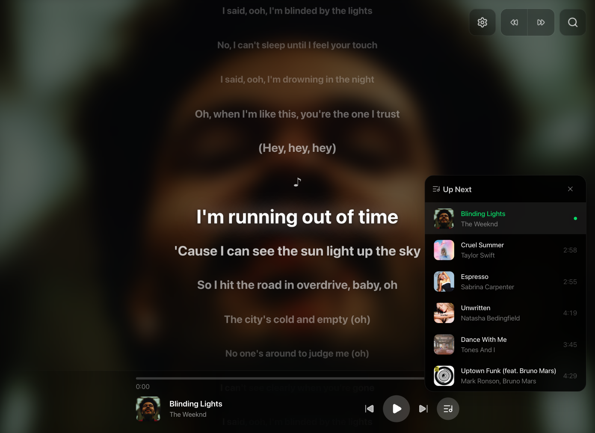

# Spotify Lyrics App

Sing along with karaoke-style lyrics synced to Spotify. It started as a personal project for the Tesla in-car browser, but it should work great in any other in-car browser (or any browser in general, of course). For daily listening or a fun karaoke night!

Official domain: [https://getlyrics.app/](https://getlyrics.app/)

This project is intentionally Spotify-only, with no plans to support other music apps.

Support the project:

<a href="https://www.buymeacoffee.com/xuso" target="_blank" rel="noreferrer">
   
</a>

## Screenshots



## Features

- **Karaoke-style flow** — the current lyric stands out, so it is easy to follow while you sing
- **Stays in sync with Spotify** — lyrics follow your song in real time while you listen
- **No server setup needed** — just sign in and use it directly in your browser
- **Smart lyrics matching** — synced lyrics are used when available, with plain lyrics as a fallback
- **Manual lyrics search** — quickly find and choose different lyrics if the first match is wrong
- **Ready for the next track** — upcoming song lyrics are prepared in advance when possible
- **Faster repeat playback** — previously loaded lyrics are remembered on your device
- **Easy timing adjustment** — shift lyrics a little earlier or later to match your setup
- **Tap any line to jump** — touch a lyric line to skip to that part of the song
- **Built-in mini player** — see album art, progress, and playback controls at the bottom
- **Swipe to skip** — swipe horizontally to quickly move to the previous or next song
- **Up next list** — open the queue to see which songs are coming next
- **Adjustable text size** — make lyrics smaller or larger for comfortable reading
- **Immersive background** — album art blends into the background for a cleaner look

## Lyrics Source

Lyrics are not provided by Spotify. This app uses the free [LRCLIB](https://lrclib.net/) community database/API.

- Some songs may not have synced lyrics.
- Some songs may not have lyrics at all.
- The API can be slow at times but it's free, so please be patient while lyrics load.

## Choose Your Setup

You have three ways to use Spotify Lyrics App:

1. Use the hosted app at [https://getlyrics.app/](https://getlyrics.app/)
2. Deploy your own copy to Vercel
3. Run it locally / host it yourself

### Option 1: Use The Hosted App (Fastest)

Open [https://getlyrics.app/](https://getlyrics.app/).

Before setup, a quick note on why the app asks for a Spotify Client ID:

- Spotify requires each app integration to use its own Client ID.
- Most personal Spotify apps stay in Development mode, which has user limits.
- Using your own app avoids shared limits and makes the setup more reliable for you.
- This project is frontend-only, so your Client ID and auth data stay in your browser on your device.

Setup steps:

1. Create a Spotify app in [Spotify Developer Dashboard](https://developer.spotify.com/dashboard).
2. Add this Redirect URI to your Spotify app:

   ```
   https://getlyrics.app/callback
   ```

3. Paste your Spotify Client ID into the setup screen.
4. Continue with Spotify login.

Notes:

- Client IDs are stored in browser localStorage on your device.
- You can update or forget credentials in Settings -> Spotify Credentials.
- Since May 15, 2025, Spotify accepts Extended Quota applications only from organizations (not individuals), so public community apps usually cannot depend on a single shared personal app being upgraded. See Spotify Quota Modes: [https://developer.spotify.com/documentation/web-api/concepts/quota-modes](https://developer.spotify.com/documentation/web-api/concepts/quota-modes).

### Option 2: Deploy Your Own Copy To Vercel

[](https://vercel.com/new/clone?repository-url=https://github.com/xusoo/get-lyrics-app)

This is the fastest way to create your own Vercel copy of the project. You will still need to set up your Spotify app and redirect URI after deployment.

1. Create a Spotify app in [Spotify Developer Dashboard](https://developer.spotify.com/dashboard).
2. Import the repo into Vercel.
3. Keep default Vite framework detection.
4. Add production environment variables in Vercel:

   ```dotenv
   VITE_SPOTIFY_CLIENT_ID=your_client_id_here
   VITE_SPOTIFY_REDIRECT_URI=https://your-app.vercel.app/callback
   ```

5. In Spotify Developer Dashboard, add the same callback URL to Redirect URIs.
6. Deploy.

Important:

- `vercel.json` rewrites all routes to `index.html`, so `/callback` works on refresh/direct open.
- If you use a custom domain, replace `https://your-app.vercel.app/callback` with your final domain in both Spotify and Vercel config.
- If env vars are present, they take priority over browser-stored custom credentials.

### Option 3: Run Locally / Host Yourself

1. Create a Spotify app in [Spotify Developer Dashboard](https://developer.spotify.com/dashboard).
2. Add your local callback URL as a Redirect URI:

   ```
   http://127.0.0.1:5173/callback
   ```

3. Copy `.env.example` to `.env` and set:

   ```dotenv
   VITE_SPOTIFY_CLIENT_ID=your_client_id_here
   VITE_SPOTIFY_REDIRECT_URI=http://127.0.0.1:5173/callback
   ```

4. Install and run:

   ```bash
   npm install
   npm run dev
   ```

5. Open `http://127.0.0.1:5173`.

Build for static hosting:

```bash
npm run build
```

Then host the generated `dist/` on any static host.

## License

MIT — see [LICENSE](LICENSE).

